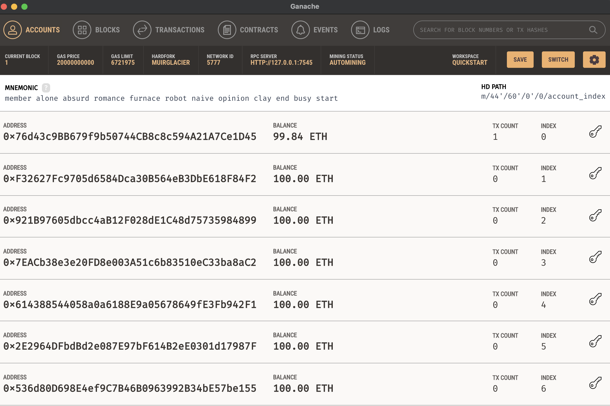
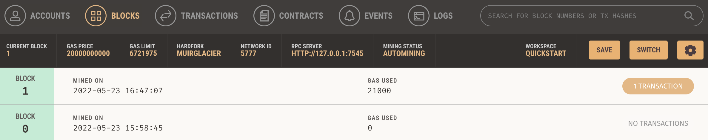
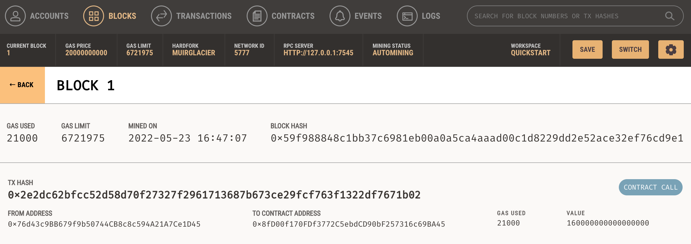
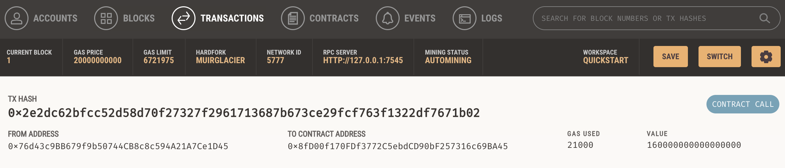
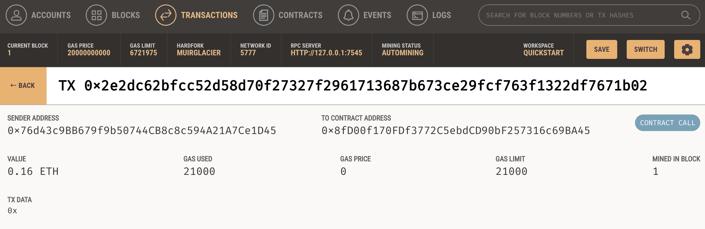

# Challenge-19

Fintech Finder is an application that users can use to find fintech professionals in a list, hire them, and send them their wages using cryptocurrency.

---
## Technologies
Fintech Finder uses the following Python 3.7 libraries:
### **streamlit** - for building the user-friendly web interface.
### **dataclasses** - for use of the *dataclass* tool in building custom classes.
### **typing** - for use of the *Any* and *List* tools in defining attributes' datatypes and building lists (the chain).
### **os** and **dotenv** - for connecting to the .env file stored on the user's computer for security via the *load_dotenv* function.
### **requests** - for request APIs
### **bip44** - for wallet connection
### **web3** - for *Account*, *middleware*, *Web3* tools
### **web3.gas_strategies.time_based** - for *medium_gas_price_strategy* tool
```python
import os
import requests
from dotenv import load_dotenv
from bip44 import Wallet
from web3 import Account
from web3 import middleware
from web3.gas_strategies.time_based import medium_gas_price_strategy
import streamlit as st
from dataclasses import dataclass
from typing import Any, List
from web3 import Web3
```
---
## Installation Guide
First, install the following on the **dev** environment, or whichever environment you would like to install **streamlit** on. Activate the environment in GitBash or Terminal, and run the following:
```
pip install streamlit
```
```
pip install requests
```
```
pip install bip44
```
```
pip install web3==5.17
```
```
pip install eth-tester==0.5.0b3
```
```
pip install mnemonic
```
You will also want to install [Ganache](https://trufflesuite.com/ganache/), a simulated ethereum environment for testing.

Then, navigate to the folder that contains this fintech_finder.py file in GitBash or Terminal for Mac. Run the following:
```
streamlit run fintech_finder.py
```
It will open the user interface in a new window on your browser.

---
## Usage
Choose a fintech professional from the list, type in the number of hours you'd like him/her to work. The app will calculate the cost of wages and click "Send Transaction" to send the cost of labor in ETH to the professional's wallet address. Confirm your transaction has taken place on Ganache.

Navigate to the *Blocks* tab to check the block transaction.

Click on the block to check the "From Address" and "To Address" is correct.

Confirm in *Transactions* tab.

Click on the transaction to confirm.


---
## Contributors
Heeje Yoo - [Email](heeje90@pm.me)

---
## License
Copyright 2022 Heeje Yoo

Permission is hereby granted, free of charge, to any person obtaining a copy of this software and associated documentation files (the "Software"), to deal in the Software without restriction, including without limitation the rights to use, copy, modify, merge, publish, distribute, sublicense, and/or sell copies of the Software, and to permit persons to whom the Software is furnished to do so, subject to the following conditions:

The above copyright notice and this permission notice shall be included in all copies or substantial portions of the Software.

THE SOFTWARE IS PROVIDED "AS IS", WITHOUT WARRANTY OF ANY KIND, EXPRESS OR IMPLIED, INCLUDING BUT NOT LIMITED TO THE WARRANTIES OF MERCHANTABILITY, FITNESS FOR A PARTICULAR PURPOSE AND NONINFRINGEMENT. IN NO EVENT SHALL THE AUTHORS OR COPYRIGHT HOLDERS BE LIABLE FOR ANY CLAIM, DAMAGES OR OTHER LIABILITY, WHETHER IN AN ACTION OF CONTRACT, TORT OR OTHERWISE, ARISING FROM, OUT OF OR IN CONNECTION WITH THE SOFTWARE OR THE USE OR OTHER DEALINGS IN THE SOFTWARE.